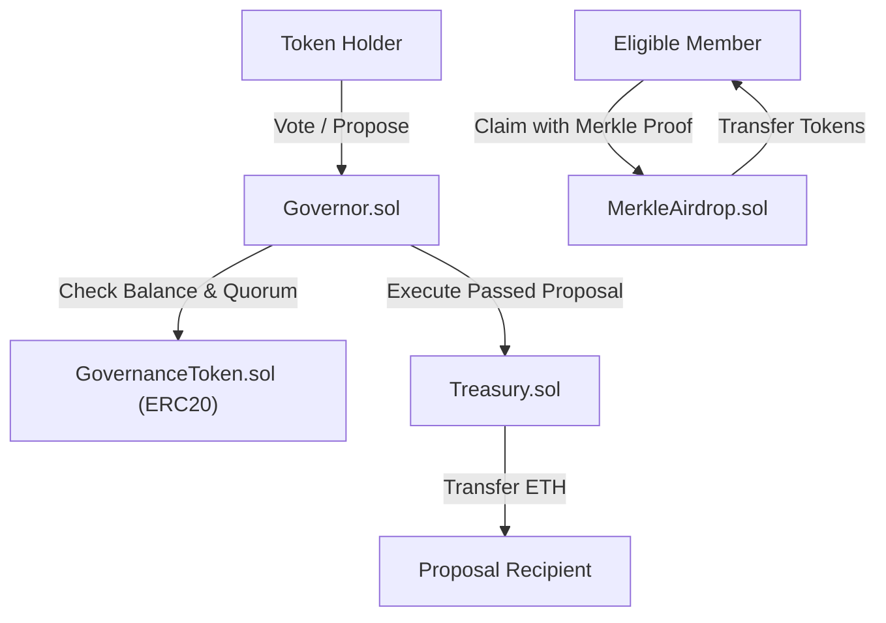

# MiniDAO & Treasury

A modular Decentralized Autonomous Organization (DAO) governance and treasury management protocol implemented in Solidity and tested using the Foundry framework.

---

## Overview

**MiniDAO** provides an end-to-end decentralized governance ecosystem designed around token-weighted voting, on-chain execution, secure treasury fund management, and gas-efficient airdrop distribution.

The protocol consists of four primary components:
1. **Governance Token (`GovernanceToken.sol`)**: An ERC20 token with EIP-2612 Permit, Pausable, and AccessControl extensions that represents voting power and membership.
2. **Governor (`Governor.sol`)**: The core governance engine handling proposal creation, vote tallying, quorum verification, and execution of arbitrary target calls.
3. **Treasury (`Treasury.sol`)**: An ETH vault that accepts deposits from anyone and only disburses funds when instructed by the Governor contract via successful governance proposals.
4. **Merkle Airdrop (`MerkleAirdrop.sol`)**: A gas-optimized token distribution mechanism that leverages cryptographic Merkle proofs to reward eligible community members while preventing double claims.

---

## Architecture



---

## Smart Contracts

### 1. `GovernanceToken.sol`
* Inherits OpenZeppelin's `ERC20`, `ERC20Pausable`, `ERC20Permit`, and `AccessControl`.
* Initial supply is minted to the designated recipient upon deployment.
* Minting and burning privileges are restricted to addresses with `GOVERNOR_ROLE`.
* Pausing functionality is controlled via `PAUSER_ROLE`.
* `DEFAULT_ADMIN_ROLE` is assigned to the deployer for administration.

### 2. `Governor.sol`
* **Proposal Creation**: Restricted to accounts holding at least `MINIMUM_TOKENS_TOKEN_HOLDER` (1,000 GTK).
* **Voting**: Token holders cast votes weighted by their token balance. Duplicate voting per proposal is prevented using the `hasVoted` mapping.
* **Quorum Enforcement**: Before execution, proposals must meet a strict quorum threshold (minimum 50% of `totalSupply`).
* **Execution**: Executes the target transaction (`target.call{value: value}(data)`) once quorum and conditions are satisfied.

### 3. `Treasury.sol`
* Receives ETH via standard transfers (`receive()` and `fallback()`) or explicitly through `deposit()`.
* Protected `withdraw(address payable recipient, uint256 amount)` function callable **strictly** by the authorized `Governor` contract address.

### 4. `MerkleAirdrop.sol`
* Uses OpenZeppelin's `MerkleProof` to verify cryptographic proofs against an immutable root hash (`MERKLE_ROOT`).
* Leaf construction uses double keccak256 hashing (`keccak256(bytes.concat(keccak256(abi.encode(account, amount))))`) to protect against second-preimage attacks.
* Tracks claimed addresses in a `hasClaimed` mapping to prevent double-claiming.

---

## Repository Structure

```text
minidao-treasury/
├── .github/workflows/       # CI/CD pipelines (Foundry automated test suite)
├── script/
│   ├── GenerateMerkle.s.sol # Foundry script to generate Merkle root & proofs
│   └── data/airdrop.json    # Airdrop recipient dataset
├── src/
│   ├── GovernanceToken.sol  # ERC20 governance token contract
│   ├── Governor.sol         # Governance proposal and voting engine
│   ├── MerkleAirdrop.sol    # Merkle tree token airdrop contract
│   └── Treasury.sol         # Vault contract holding DAO treasury funds
├── test/
│   ├── Governor/
│   │   ├── CreateProposal.t.sol # Proposal creation test suite
│   │   └── VoteProposal.t.sol   # Proposal voting test suite
│   ├── MerkleAirdrop.t.sol  # Merkle airdrop test suite
│   └── Treasury.t.sol       # Treasury deposit and withdrawal test suite
└── foundry.toml             # Foundry project configuration
```

---

## Getting Started

### Prerequisites

* [Foundry](https://getfoundry.sh/) (`forge`, `cast`, `anvil`)
* [Git](https://git-scm.com/)

### Installation

Clone the repository with submodules:

```bash
git clone --recurse-submodules https://github.com/saftanasdalihin/minidao-treasury.git
cd minidao-treasury
```

If already cloned without submodules, initialize them:

```bash
git submodule update --init --recursive
```

### Build

Compile the smart contracts:

```bash
forge build
```

### Running Tests

Execute the Foundry test suite:

```bash
forge test
```

Run tests with verbose traces:

```bash
forge test -vvv
```

### Generating Merkle Tree & Proofs

To generate the Merkle root and cryptographic proofs from `script/data/airdrop.json`:

```bash
forge script script/GenerateMerkle.s.sol
```

Ensure `foundry.toml` has `fs_permissions` enabled for file system read access.

---

## Security & Design Considerations

* **Token Balance Check vs Snapshot**: The current implementation checks real-time `balanceOf(msg.sender)` during voting. In production environments, integrating ERC20Votes (checkpoint/snapshot-based historical balance lookup) is recommended to prevent vote manipulation via flash loans or token transfers between voters.
* **Quorum Protection**: Execution requires total votes to reach at least 50% of the total token supply to protect against low-turnout malicious proposals.
* **Separation of Concerns**: The Treasury has no arbitrary admin key; funds can only exit through passed and executed governance proposals.

---

## License

This project is licensed under the [MIT License](LICENSE).
